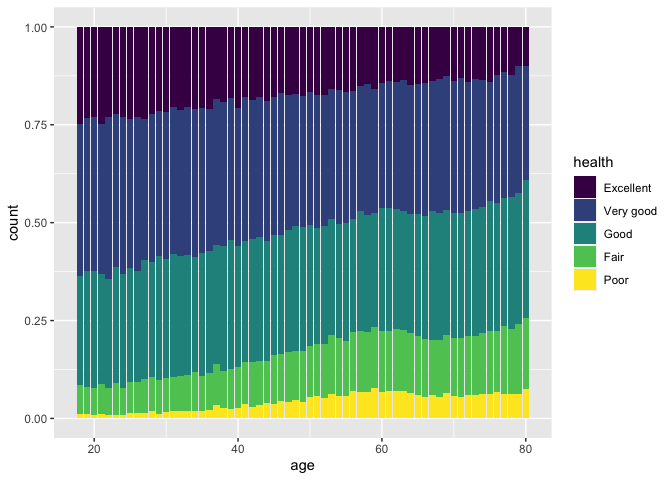
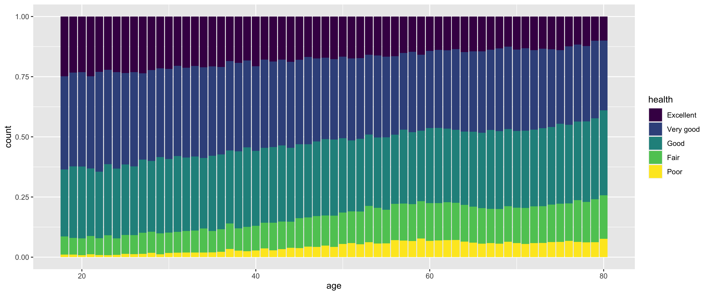

``` r
library(tidyverse)
load("cdc_health.RData")
head(cdc_health, 10) %>% select(-education, -coverage) # To save space
```

<div class="kable-table">

| gender | race  | age | weight | height | employment     | income    | urban | exercise | smoker | fruit              | health    |
| :----- | :---- | --: | -----: | -----: | :------------- | :-------- | :---- | :------- | :----- | :----------------- | :-------- |
| Female | Black |  80 |     70 |    157 | Retired        | $15K-$20K | Yes   | No       | Yes    | Daily              | Good      |
| Female | White |  70 |     49 |    163 | Retired        | $25K-$35K | Yes   | Yes      | No     | A few times a year | Fair      |
| Female | Black |  67 |     86 |    165 | Retired        | $50K-$75K | Yes   | Yes      | No     | Daily              | Good      |
| Male   | White |  71 |    113 |    185 | Retired        | $50K-$75K | No    | Yes      | Yes    | Daily              | Very good |
| Male   | White |  77 |     78 |    180 | Retired        | $25K-$35K | No    | Yes      | Yes    | Daily              | Good      |
| Female | White |  71 |     43 |    160 | Unable to work | $15K-$20K | Yes   | No       | Yes    | Weekly             | Poor      |
| Female | White |  70 |     59 |    163 | Retired        | $50K-$75K | Yes   | Yes      | Yes    | Daily              | Very good |
| Male   | White |  76 |     70 |    165 | Retired        | \>$75K    | Yes   | Yes      | Yes    | Weekly             | Excellent |
| Male   | White |  72 |     88 |    180 | Unable to work | $25K-$35K | No    | Yes      | No     | Daily              | Fair      |
| Female | White |  51 |     78 |    173 | Self-employed  | $35K-$50K | Yes   | Yes      | No     | Daily              | Excellent |

</div>

``` r
summary(cdc_health)
```

    ##     gender                                      race             age       
    ##  Male  :141354   White                            :230017   Min.   :18.00  
    ##  Female:154196   Black                            : 21612   1st Qu.:42.00  
    ##                  Hispanic                         : 20389   Median :58.00  
    ##                  Multiracial                      :  6076   Mean   :55.11  
    ##                  Asian                            :  6010   3rd Qu.:69.00  
    ##                  American Indian or Alaskan Native:  4671   Max.   :80.00  
    ##                  (Other)                          :  6775                  
    ##      weight           height                                 education     
    ##  Min.   : 23.00   Min.   : 91.0   Never attended or kindergarten  :   219  
    ##  1st Qu.: 68.00   1st Qu.:163.0   Elementary                      :  5018  
    ##  Median : 81.00   Median :170.0   Some high school                : 11854  
    ##  Mean   : 83.13   Mean   :170.5   High school graduate            : 74337  
    ##  3rd Qu.: 95.00   3rd Qu.:178.0   Some college or technical school: 84049  
    ##  Max.   :277.00   Max.   :241.0   College graduate                :120073  
    ##                                                                            
    ##               employment           income       urban        exercise    
    ##  Employed for wages:128061   >$75K    :106925   Yes:203462   Yes:220355  
    ##  Retired           : 88419   $50K-$75K: 48677   No : 92088   No : 75195  
    ##  Self-employed     : 27972   $35K-$50K: 41168                            
    ##  Unable to work    : 20188   $25K-$35K: 29661                            
    ##  Homemaker         : 12351   $20K-$25K: 25101                            
    ##  Student           :  6921   $15K-$20K: 19009                            
    ##  (Other)           : 11638   (Other)  : 25009                            
    ##  smoker                          fruit        coverage           health      
    ##  Yes:128115   Daily                 :151199   Yes:272736   Excellent: 47671  
    ##  No :167435   Weekly                : 89117   No : 22814   Very good:100713  
    ##               Less than once a month:  1767                Good     : 92493  
    ##               A few times a year    : 42879                Fair     : 39780  
    ##               Never                 : 10588                Poor     : 14893  
    ##                                                                              
    ## 

# Distribution of health values through the ages

``` r
cdc_health %>%
    ggplot(aes(x = age, fill = health)) + geom_bar(position="fill")
```

<!-- -->

# Impact of income and exercise

``` r
cdc_health %>%
    group_by(income, exercise) %>%
    summarise(avg_health = mean(as.numeric(health))) %>%
    ggplot(aes(x = income, y = avg_health, fill = exercise)) + geom_col(position = "dodge") +
    scale_fill_manual(values = c("#FF861B", "#1184FF")) + ylab("Average health score")
```

<!-- -->
