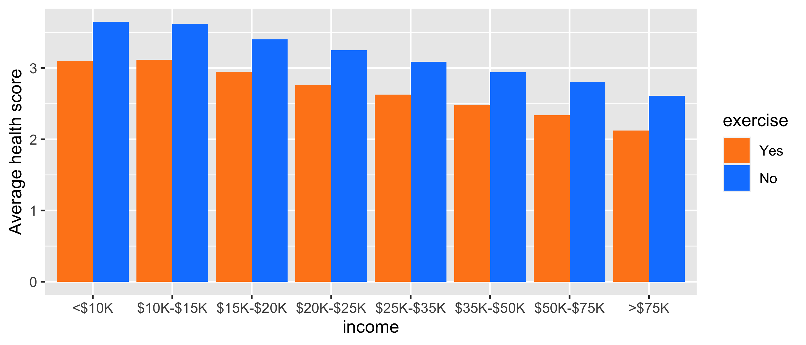

# Snapshot of the data

``` r
library(tidyverse)
library(tictoc)                                                 # Tracking compute time
load("data/health_2019.RData")
head(health_2019, 10) %>% select(-education, -coverage, -fruit) # To save space
```

<div class="kable-table">

| gender | race  | age | weight | height | employment     | income    | urban | exercise | smoker | health    |
| :----- | :---- | --: | -----: | -----: | :------------- | :-------- | :---- | :------- | :----- | :-------- |
| Female | Black |  80 |     70 |    157 | Retired        | $15K-$20K | Yes   | No       | Yes    | Good      |
| Female | White |  70 |     49 |    163 | Retired        | $25K-$35K | Yes   | Yes      | No     | Fair      |
| Female | Black |  67 |     86 |    165 | Retired        | $50K-$75K | Yes   | Yes      | No     | Good      |
| Male   | White |  71 |    113 |    185 | Retired        | $50K-$75K | No    | Yes      | Yes    | Very good |
| Male   | White |  77 |     78 |    180 | Retired        | $25K-$35K | No    | Yes      | Yes    | Good      |
| Female | White |  71 |     43 |    160 | Unable to work | $15K-$20K | Yes   | No       | Yes    | Poor      |
| Female | White |  70 |     59 |    163 | Retired        | $50K-$75K | Yes   | Yes      | Yes    | Very good |
| Male   | White |  76 |     70 |    165 | Retired        | \>$75K    | Yes   | Yes      | Yes    | Excellent |
| Male   | White |  72 |     88 |    180 | Unable to work | $25K-$35K | No    | Yes      | No     | Fair      |
| Female | White |  51 |     78 |    173 | Self-employed  | $35K-$50K | Yes   | Yes      | No     | Excellent |

</div>

# Descriptive statistics

``` r
summary(health_2019)
```

    ##     gender                                      race             age       
    ##  Male  :141354   White                            :230017   Min.   :18.00  
    ##  Female:154196   Black                            : 21612   1st Qu.:42.00  
    ##                  Hispanic                         : 20389   Median :58.00  
    ##                  Multiracial                      :  6076   Mean   :55.11  
    ##                  Asian                            :  6010   3rd Qu.:69.00  
    ##                  American Indian or Alaskan Native:  4671   Max.   :80.00  
    ##                  (Other)                          :  6775                  
    ##      weight           height                                 education     
    ##  Min.   : 23.00   Min.   : 91.0   Never attended or kindergarten  :   219  
    ##  1st Qu.: 68.00   1st Qu.:163.0   Elementary                      :  5018  
    ##  Median : 81.00   Median :170.0   Some high school                : 11854  
    ##  Mean   : 83.13   Mean   :170.5   High school graduate            : 74337  
    ##  3rd Qu.: 95.00   3rd Qu.:178.0   Some college or technical school: 84049  
    ##  Max.   :277.00   Max.   :241.0   College graduate                :120073  
    ##                                                                            
    ##               employment           income       urban        exercise    
    ##  Employed for wages:128061   >$75K    :106925   Yes:203462   Yes:220355  
    ##  Retired           : 88419   $50K-$75K: 48677   No : 92088   No : 75195  
    ##  Self-employed     : 27972   $35K-$50K: 41168                            
    ##  Unable to work    : 20188   $25K-$35K: 29661                            
    ##  Homemaker         : 12351   $20K-$25K: 25101                            
    ##  Student           :  6921   $15K-$20K: 19009                            
    ##  (Other)           : 11638   (Other)  : 25009                            
    ##  smoker                          fruit        coverage           health      
    ##  Yes:128115   Daily                 :151199   Yes:272736   Excellent: 47671  
    ##  No :167435   Weekly                : 89117   No : 22814   Very good:100713  
    ##               A few times a month   : 42879                Good     : 92493  
    ##               Less than once a month:  1767                Fair     : 39780  
    ##               Never                 : 10588                Poor     : 14893  
    ##                                                                              
    ## 

# Distribution of health assessment through the ages

``` r
health_2019 %>%
    ggplot(aes(x = age, fill = health)) + geom_bar(position="fill")
```

<!-- -->

# Impact of income and exercise

We recall that the code is 1 = Excellent, …, 5 = Poor. Health assessment
scores are averaged across subgroups and shown below.

``` r
health_2019 %>%
    group_by(income, exercise) %>%
    summarise(avg_health = mean(as.numeric(health))) %>%
    ggplot(aes(x = income, y = avg_health, fill = exercise)) + geom_col(position = "dodge") +
    scale_fill_manual(values = c("#FF861B", "#1184FF")) + ylab("Average health score")
```

<!-- -->

# Supervised learning

The aim is to explain/predict the health situation with the other
variables in the data. We use a boosted tree algorithm, see:
<https://xgboost.readthedocs.io/en/latest/> for documentation.

## Data preparation

We digitize our variables. After processing, the label (*health*) takes
values 0 = Excellent, …. 4 = Poor. This is to allow for classification
instead of regression (XGBoost convention).

``` r
library(xgboost)                                   # Load package
health_2019 <- health_2019 %>%
    mutate(BMI = weight/height^2 * 10^4) %>%       # Body Mass index
    filter(BMI > 15, BMI < 50) %>%                 # Remove outliers
    select(-BMI)
train_features <- health_2019 %>% 
    select(-health, -race, -employment) %>%        # Remove dependent var. + unordered features
    mutate_if(is.factor, as.numeric) %>%           # Transform gender & exercise in numbers
    as.matrix()                                    # Force matrix format
train_label <- as.numeric(health_2019$health)      # Dependent variable
train_label <- train_label - 1                     # For classification mostly
train_matrix <- xgb.DMatrix(data = train_features, # XGB format!
                            label = train_label)  
```

## Model

The hyperparameters are chosen quite randomly. We refrain from a deep
structure to reduce computation times.

``` r
tictoc::tic()
fit <- train_matrix %>% 
    xgb.train(data = .,                       # Data source (pipe input)
              eta = 0.2,                      # Learning rate
              objective = "reg:squarederror",
              #objective = "multi:softmax",    # Objective function: another option!
              #num_class = 5,                  # Number of classes
              max_depth = 5,                  # Maximum depth of trees
              subsample = 0.6,                # Proportion of rows per training round
              lambda = 1,                     # Penalisation of leaf values
              gamma = 0.1,                    # Penalisation of number of leaves
              nrounds = 50,                   # Number of trees used
              verbose = 0                     # No comment
    )
tictoc::toc()
```

    ## 18.347 sec elapsed

Histogram of predicted health scores.

``` r
hist(predict(fit, train_features), nclass = 50)  # Histograms of predicted values
```

<!-- -->

Best profile.

``` r
health_2019[which(min(predict(fit, train_features))==predict(fit, train_features)),]
```

<div class="kable-table">

| gender | race  | age | weight | height | education        | employment         | income | urban | exercise | smoker | fruit | coverage | health |
| :----- | :---- | --: | -----: | -----: | :--------------- | :----------------- | :----- | :---- | :------- | :----- | :---- | :------- | :----- |
| Male   | White |  32 |     67 |    191 | College graduate | Employed for wages | \>$75K | Yes   | Yes      | No     | Daily | No       | Good   |

</div>

## Test\!

``` r
healthy_young_woman <- tibble(
    gender = 2,
    age = 20,
    weight = 60,
    height = 170,
    education = 3,
    income = 5,
    urban = 1,
    exercise = 1,
    smoker = 2,
    fruit = 1,
    coverage = 1
) %>% as.matrix()

predict(fit, healthy_young_woman)    # Rich young exercising non-smoking female
```

    ## [1] 1.298436

``` r
overweight_old_man <- tibble(
    gender = 1,
    age = 78,
    weight = 120,
    height = 180,
    education = 3,
    income = 1,
    urban = 1,
    exercise = 2,
    smoker = 1,
    fruit = 3,
    coverage = 0
) %>% as.matrix()
predict(fit, overweight_old_man)  # Poor old overweight smoking male
```

    ## [1] 2.961659

## Feature importance

``` r
xgb.importance(model = fit) %>%
    ggplot(aes(x = Gain, y = reorder(Feature, Gain))) + geom_col() + ylab("Feature")
```

<!-- -->
